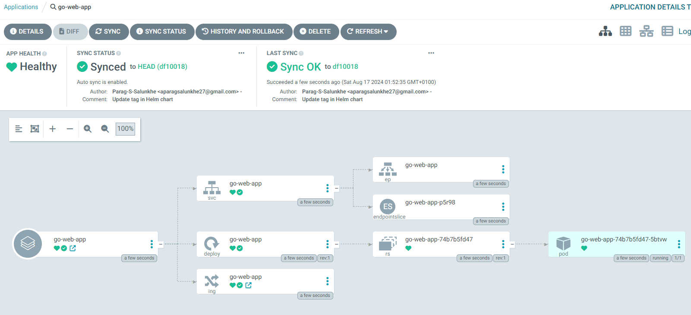

# Install Argo CD

## Install Argo CD using manifests

```bash
kubectl create namespace argocd
kubectl apply -n argocd -f https://raw.githubusercontent.com/argoproj/argo-cd/stable/manifests/install.yaml
```

What it does: This command applies the Argo CD installation manifest, which is fetched from the official Argo CD GitHub repository. It instructs Kubernetes to create various resources like deployments, services, and configuration necessary for running Argo CD.

The -n argocd flag ensures that all these resources are deployed within the argocd namespace you created in the previous step.

Resources created: The manifest typically creates:

Deployments: Pods running Argo CD components like the API server, repo server, controller, and application controller.

Services: Services to expose Argo CD components internally or externally.

ConfigMaps and Secrets: Configuration files and credentials needed by Argo CD to function.

Outcome: After this command is executed, the Argo CD components are running in the argocd namespace. However, by default, the Argo CD server (UI/API) will not be accessible externally unless further steps are taken.

## Access the Argo CD UI (Loadbalancer service) 

```bash
kubectl patch svc argocd-server -n argocd -p '{"spec": {"type": "LoadBalancer"}}'
```

What it does: This command modifies (patches) the service argocd-server in the argocd namespace. Specifically, it changes the service type from the default (likely ClusterIP or NodePort) to LoadBalancer.

A LoadBalancer type service requests an external load balancer (e.g., from AWS, GCP, or Azure) to handle traffic to Argo CD.

The argocd-server service is responsible for exposing the Argo CD UI and API, and this patch ensures that it’s accessible from outside the cluster via a public IP or DNS.

What happens behind the scenes:

When Kubernetes sees that the service type is changed to LoadBalancer, it interacts with your cloud provider’s API to provision an external load balancer.
The load balancer gets a public IP or DNS endpoint, and any traffic directed to this endpoint is routed to the argocd-server service.

Outcome: Now, Argo CD is accessible externally. You can access the Argo CD UI and API through the public IP or DNS of the load balancer, which will forward requests to the argocd-server inside the Kubernetes cluster.

## Access the Argo CD UI (Loadbalancer service) -For Windows

```bash
kubectl patch svc argocd-server -n argocd -p '{\"spec\": {\"type\": \"LoadBalancer\"}}'
```

## Get the Loadbalancer service IP

```bash
kubectl get svc argocd-server
```

to set password on argo ui run
```
kubectl get secrets -n argocd
kubectl edit secrets argocd-initial-admin-secret -n argocd
```


decode the base64 encoded password and sign in.

sync policy set as automatic and self heal. insert all other configurations . argo cd starts deploying deployment , service and ingress.

Argo will pull values from helm chart when CI is completedand update any changes made


